## ggplot Part 1


In a previous lesson we showed you the vast capabilities of qplot, the basic workhorse function of the ggplot2 package. In this lesson we'll focus on some fundamental components of the package. These underlie qplot which uses default values when it calls them. If you understand these building blocks, you will be better able to customize your plots. We'll use the second workhorse function in the package, ggplot, as well as other graphing functions.

A "grammar" of graphics means that ggplot2 contains building blocks with which you can create your own graphical objects. What are these basic components of ggplot2 plots? There are 7 of them.

Obviously, there's a DATA FRAME which contains the data you're trying to plot. Then the AESTHETIC MAPPINGS determine how data are mapped to color, size, etc. The GEOMS (geometric objects) are what you see in the plot (points, lines, shapes) and FACETS are the panels used in conditional plots. You've used these or seen them used in the first ggplot2 (qplot) lesson.

There are 3 more. STATS are statistical transformations such as binning, quantiles, and smoothing which ggplot2 applies to the data. SCALES show what coding an aesthetic map uses (for example, male = red, female = blue). Finally, the plots are depicted on a COORDINATE SYSTEM. When you use qplot these were taken care of for you.

We'll keep using the mpg data that comes with the ggplot2 package. Recall the versatility of qplot. Just as a refresher, call qplot now with 5 arguments. The first 3 deal with data - displ, hwy, and data=mpg. The fourth is geom set equal to the concatenation of the two strings, "point" and "smooth". The fifth is facets set equal to the formula .~drv. Try this now.


```r
qplot(displ, hwy, data = mpg, geom = c("point", "smooth"), facets = .~drv)
```

```
## `geom_smooth()` using method = 'loess' and formula 'y ~ x'
```

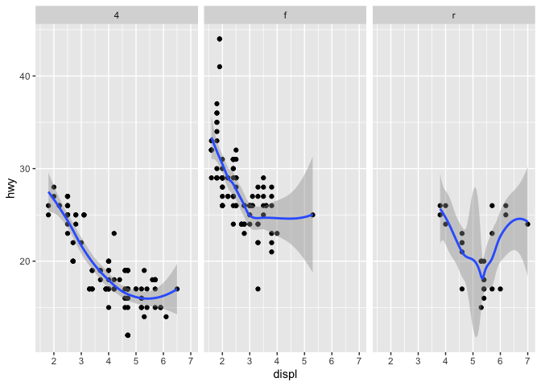<!-- -->

We see a 3 facet plot, one for each drive type (4, f, and r). Now we'll see how ggplot works. We'll build up a similar plot using the basic components of the package. We'll do this in a series of steps.

First we'll create a variable g by assigning to it the output of a call to ggplot with 2 arguments. The first is mpg (our dataset) and the second will tell ggplot what we want to plot, in this case, displ and hwy. These are what we want our aesthetics to represent so we enclose these as two arguments to the function aes. Try this now.


```r
g <- ggplot(mpg, aes(displ, hwy))
```

Notice that nothing happened? As in the lattice system, ggplot created a graphical object which we assigned to the variable g.

Run the R command summary with g as its argument to see what g contains.


```r
summary(g)
```

```
## data: manufacturer, model, displ, year, cyl, trans, drv, cty, hwy, fl,
##   class [234x11]
## mapping:  x = ~displ, y = ~hwy
## faceting: <ggproto object: Class FacetNull, Facet, gg>
##     compute_layout: function
##     draw_back: function
##     draw_front: function
##     draw_labels: function
##     draw_panels: function
##     finish_data: function
##     init_scales: function
##     map_data: function
##     params: list
##     setup_data: function
##     setup_params: function
##     shrink: TRUE
##     train_scales: function
##     vars: function
##     super:  <ggproto object: Class FacetNull, Facet, gg>
```

So g contains the mpg data with all its named components in a 234 by 11 matrix. It also contains a mapping, x (displ) and y (hwy) which you specified, and no faceting.

Note that if you tried to print g with the expressions g or print(g) you'd get an error! Even though it's a great package, ggplot doesn't know how to display the data yet since you didn't specify how you wanted to see it. Now type g+geom_point() and see what happens.


```r
g+geom_point()
```

<!-- -->

By calling the function geom_point you added a layer. By not assigning the expression to a variable you displayed a plot. Notice that you didn't have to pass any arguments to the function geom_point. That's because the object g has all the data stored in it. (Remember you saw that when you ran summary on g before.) Now use the expression you just typed (g + geom_point()) and add to it another layer, a call to geom_smooth(). Notice the red message R gives you.


```r
g+geom_point() + geom_smooth()
```

```
## `geom_smooth()` using method = 'loess' and formula 'y ~ x'
```

<!-- -->

The gray shadow around the blue line is the confidence band. See how wide it is at the right? Let's try a different smoothing function. Use the up arrow to recover the expression you just typed, and instead of calling geom_smooth with no arguments, call it with the argument method set equal to the string "lm".


```r
g+geom_point() + geom_smooth(method="lm")
```

```
## `geom_smooth()` using formula 'y ~ x'
```

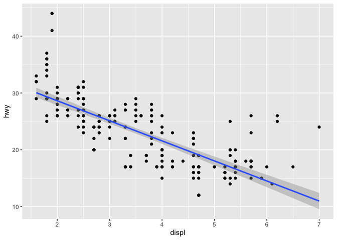<!-- -->

By changing the smoothing function to "lm" (linear model) ggplot2 generated a regression line through the data. Now recall the expression you just used and add to it another call, this time to the function facet_grid. Use the formula . ~ drv as it argument. Note that this is the same type of formula used in the calls to qplot.


```r
g+geom_point() + geom_smooth(method="lm") + facet_grid(.~drv)
```

```
## `geom_smooth()` using formula 'y ~ x'
```

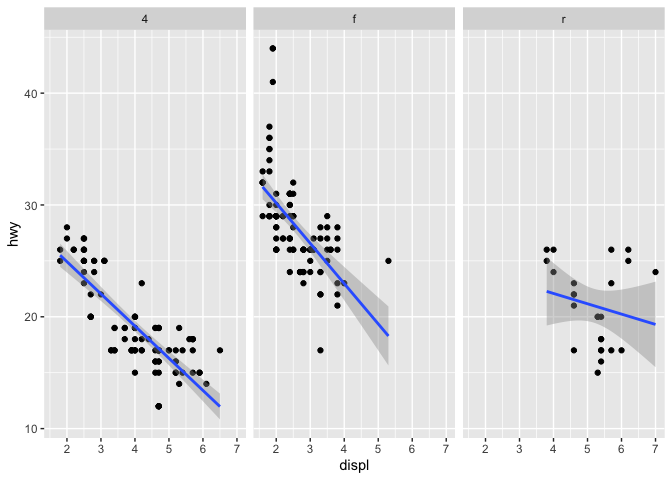<!-- -->

Notice how each panel is labeled with the appropriate factor. All the data associated with 4-wheel drive cars is in the leftmost panel, front-wheel drive data is shown in the middle panel, and rear-wheel drive data in the rightmost. Notice that this is similar to the plot you created at the start of the lesson using qplot. (We used a different smoothing function than previously.)

So far you've just used the default labels that ggplot provides. You can add your own annotation using functions such as xlab(), ylab(), and ggtitle(). In addition, the function labs() is more general and can be used to label either or both axes as well as provide a title. Now recall the expression you just typed and add a call to the function ggtitle with the argument "Swirl Rules!".


```r
g+geom_point() + geom_smooth(method="lm") + facet_grid(.~drv) + ggtitle("Swirl Rules!")
```

```
## `geom_smooth()` using formula 'y ~ x'
```

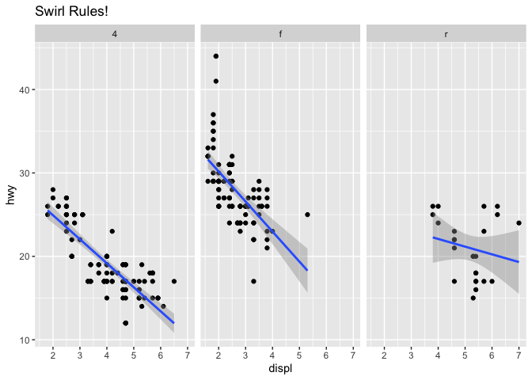<!-- -->

Now that you've seen the basics we'll talk about customizing. Each of the “geom” functions (e.g., _point and _smooth) has options to modify it. Also, the function theme() can be used to modify aspects of the entire plot, e.g. the position of the legend. Two standard appearance themes are included in ggplot. These are theme_gray() which is the default theme (gray background with white grid lines) and theme_bw() which is a plainer (black and white) color scheme.

Let's practice modifying aesthetics now. We'll use the graphic object g that we already filled with mpg data and add a call to the function geom_point, but this time we'll give geom_point 3 arguments. Set the argument color equal to "pink", the argument size to 4, and the argument alpha to 1/2. Notice that all the arguments are set equal to constants.


```r
g+geom_point(color="pink", size=4, alpha=1/2)
```

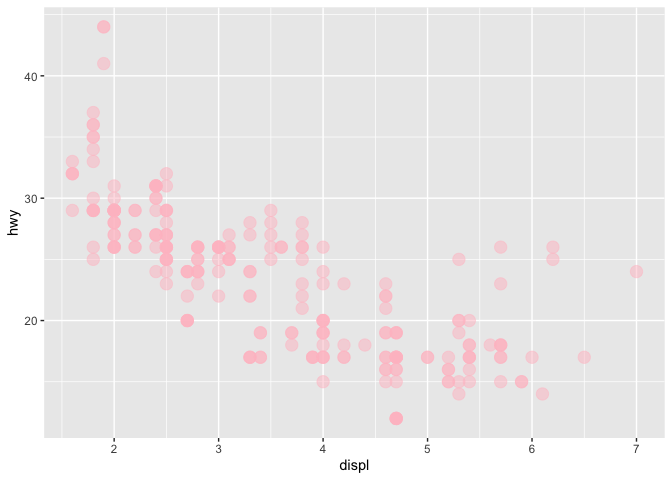<!-- -->

Notice the different shades of pink? That's the result of the alpha aesthetic which you set to 1/2. This aesthetic tells ggplot how transparent the points should be. Darker circles indicate values hit by multiple data points.

Now we'll modify the aesthetics so that color indicates which drv type each point represents. Again, use g and add to it a call to the function geom_point with 3 arguments. The first is size set equal to 4, the second is alpha equal to 1/2. The third is a call to the function aes with the argument color set equal to drv. Note that you MUST use the function aes since the color of the points is data dependent and not a constant as it was in the previous example.


```r
g+geom_point(size=4, alpha=1/2, aes(color=drv))
```

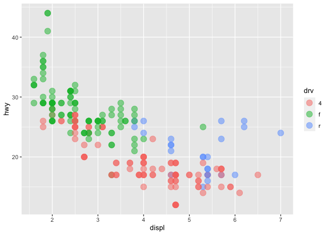<!-- -->

Notice the helpful legend on the right decoding the relationship between color and drv.

Now we'll practice modifying labels. Again, we'll use g and add to it calls to 3 functions. First, add a call to geom_point with an argument making the color dependent on the drv type (as we did in the previous example). Second, add a call to the function labs with the argument title set equal to "Swirl Rules!". Finally, add a call to labs with 2 arguments, one setting x equal to "Displacement" and the other setting y equal to "Hwy Mileage".


```r
g + geom_point(aes(color = drv)) + labs(title="Swirl Rules!") + labs(x="Displacement", y="Hwy Mileage")
```

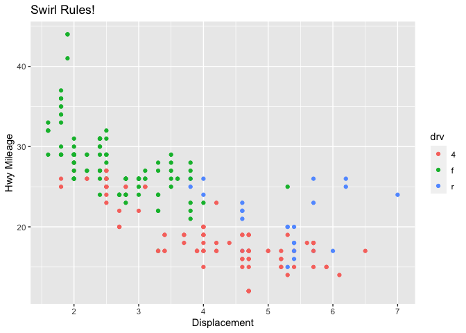<!-- -->

Note that you could have combined the two calls to the function labs in the previous example. Now we'll practice customizing the geom_smooth calls. Use g and add to it a call to geom_point setting the color to drv type (remember to use the call to the aes function), size set to 2 and alpha to 1/2. Then add a call to geom_smooth with 4 arguments. Set size equal to 4, linetype to 3, method to "lm", and se to FALSE.


```r
g + geom_point(aes(color = drv), size=2, alpha=1/2) + geom_smooth(size=4, linetype=3, method="lm", se=FALSE)
```

```
## `geom_smooth()` using formula 'y ~ x'
```

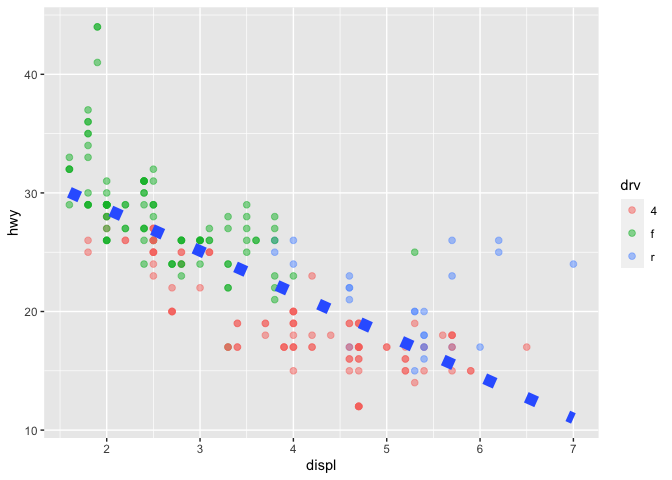<!-- -->

What did these arguments do? The method specified a linear regression (note the negative slope indicating that the bigger the displacement the lower the gas mileage), the linetype specified that it should be dashed (not continuous), the size made the dashes big, and the se flag told ggplot to turn off the gray shadows indicating standard errors (confidence intervals).

Finally, let's do a simple plot using the black and white theme, theme_bw. Specify g and add a call to the function geom_point with the argument setting the color to the drv type. Then add a call to the function theme_bw with the argument base_family set equal to "Times". See if you notice the difference.


```r
g + geom_point(aes(color = drv)) + theme_bw(base_family="Times")
```

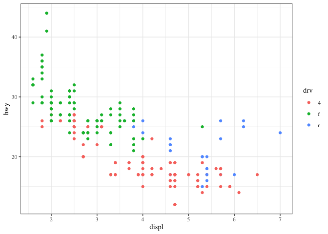<!-- -->

No more gray background! Also, if you have good eyesight, you'll notice that the font in the labels changed.

One final note before we go through a more complicated, layered ggplot example, and this concerns the limits of the axes. We're pointing this out to emphasize a subtle difference between ggplot and the base plotting function plot.

We've created some random x and y data, called myx and myy, components of a dataframe called testdat. These represent 100 random normal points, except halfway through, we made one of the points be an outlier. That is, we set its y-value to be out of range of the other points. Use the base plotting function plot to create a line plot of this data. Call it with 4 arguments - myx, myy, type="l", and ylim=c(-3,3). The type="l" tells plot you want to display the data as a line instead of as a scatterplot.


```r
#plot(myx, myy, type="l", ylim=c(-3, 3))
```


Notice how plot plotted the points in the (-3,3) range for y-values. The outlier at (50,100) is NOT shown on the line plot. Now we'll plot the same data with ggplot. Recall that the name of the dataframe is testdat. Create the graphical object g with a call to ggplot with 2 arguments, testdat (the data) and a call to aes with 2 arguments, x set equal to myx, and y set equal to myy.


```r
#g <- ggplot(testdat, aes(x=myx, y=myy))
```

Now add a call to geom_line with 0 arguments to g.


```r
#g + geom_line()
```


Notice how ggplot DID display the outlier point at (50,100). As a result the rest of the data is smashed down so you don't get to see what the bulk of it looks like. The single outlier probably isn't important enough to dominate the graph. How do we get ggplot to behave more like plot in a situation like this?

Let's take a guess that in addition to adding geom_line() to g we also just have to add ylim(-3,3) to it as we did with the call to plot. Try this now to see what happens.


```r
#g + geom_line() + ylim(-3, 3)
```


Notice that by doing this, ggplot simply ignored the outlier point at (50,100). There's a break in the line which isn't very noticeable. Now recall that at the beginning of the lesson we mentioned 7 components of a ggplot plot, one of which was a coordinate system. This is a situation where using a coordinate system would be helpful. Instead of adding ylim(-3,3) to the expression g+geom_line(), add a call to the function coord_cartesian with the argument ylim set equal to c(-3,3).


```r
#g + geom_line() + coord_cartesian(ylim=c(-3, 3))
```


See the difference? This looks more like the plot produced by the base plot function. The outlier y value at x=50 is not shown, but the plot indicates that it is larger than 3.

We'll close with a more complicated example to show you the full power of ggplot and the entire ggplot2 package. We'll continue to work with the mpg dataset.

Start by creating the graphical object g by assigning to it a call to ggplot with 2 arguments. The first is the dataset and the second is a call to the function aes. This call will have 3 arguments, x set equal to displ, y set equal to hwy, and color set equal to factor(year). This last will allow us to distinguish between the two manufacturing years (1999 and 2008) in our data.


```r
g <- ggplot(mpg,aes(x=displ,y=hwy,color=factor(year))) 
```

We'll build the plot up step by step. First add to g a call to the function geom_point with 0 arguments.


```r
g + geom_point()
```

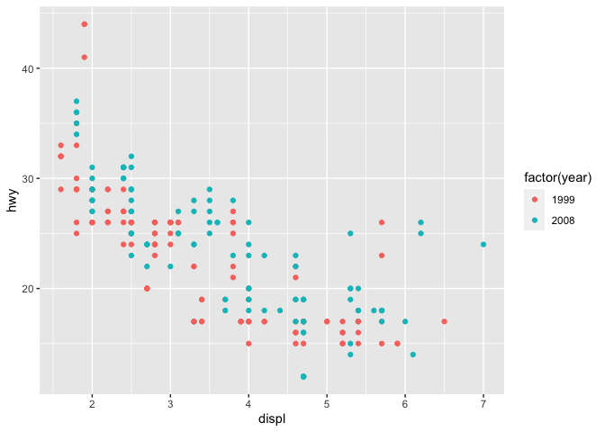<!-- -->

A simple, yet comfortingly familiar scatterplot appears. Let's make our display a 2 dimensional multi-panel plot. Recall your last command (with the up arrow) and add to it a call the function facet_grid. Give it 2 arguments. The first is the formula drv~cyl, and the second is the argument margins set equal to TRUE. Try this now.


```r
g + geom_point() + facet_grid(drv~cyl, margins=TRUE)
```

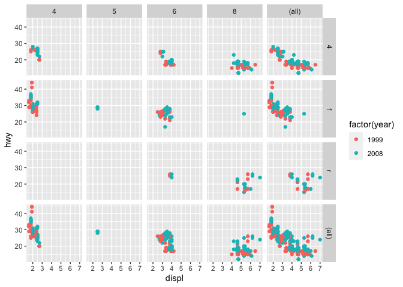<!-- -->

A 4 by 5 plot, huh? The margins argument tells ggplot to display the marginal totals over each row and column, so instead of seeing 3 rows (the number of drv factors) and 4 columns (the number of cyl factors) we see a 4 by 5 display. Note that the panel in position (4,5) is a tiny version of the scatterplot of the entire dataset.

Now add to your last command (or retype it if you like to type) a call to geom_smooth with 4 arguments. These are method set to "lm", se set to FALSE, size set to 2, and color set to "black".


```r
g + geom_point() + facet_grid(drv~cyl, margins=TRUE) + geom_smooth(method="lm", se=FALSE, size=2, color="black")
```

```
## `geom_smooth()` using formula 'y ~ x'
```

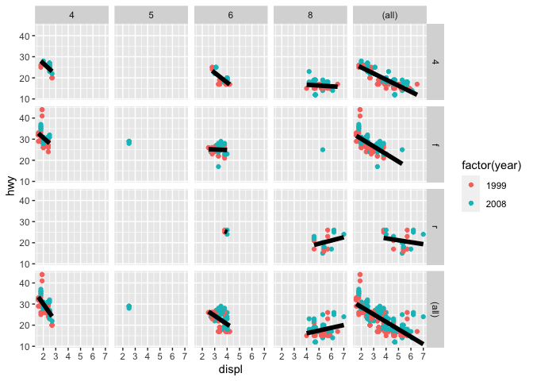<!-- -->

Angry Birds? Finally, add to your last command (or retype it if you like to type) a call to the function labs with 3 arguments. These are x set to "Displacement", y set to "Highway Mileage", and title set to "Swirl Rules!".


```r
g + geom_point() + facet_grid(drv~cyl, margins=TRUE) + geom_smooth(method="lm", se=FALSE, size=2, color="black") + labs(x="Displacement", y="Highway Mileage", title="Swirl Rules!")
```

```
## `geom_smooth()` using formula 'y ~ x'
```

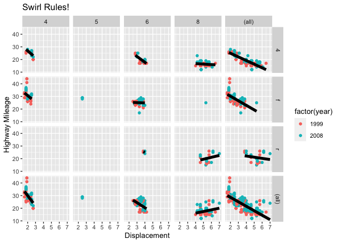<!-- -->
