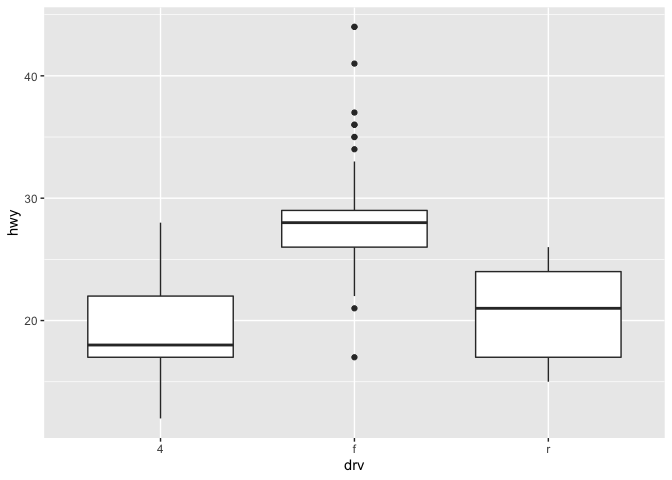
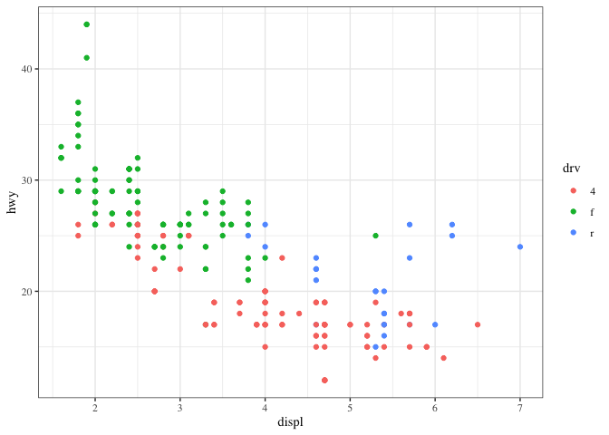

## ggplot Part 2


In this lesson we'll go through a few more qplot examples using diamond data which comes with the ggplot2 package. This data is a little more complicated than the mpg data and it contains information on various characteristics of diamonds.

Run the R command str with the argument diamonds to see what the data looks like.


```r
str(diamonds)
```

```
## Classes 'tbl_df', 'tbl' and 'data.frame':	53940 obs. of  10 variables:
##  $ carat  : num  0.23 0.21 0.23 0.29 0.31 0.24 0.24 0.26 0.22 0.23 ...
##  $ cut    : Ord.factor w/ 5 levels "Fair"<"Good"<..: 5 4 2 4 2 3 3 3 1 3 ...
##  $ color  : Ord.factor w/ 7 levels "D"<"E"<"F"<"G"<..: 2 2 2 6 7 7 6 5 2 5 ...
##  $ clarity: Ord.factor w/ 8 levels "I1"<"SI2"<"SI1"<..: 2 3 5 4 2 6 7 3 4 5 ...
##  $ depth  : num  61.5 59.8 56.9 62.4 63.3 62.8 62.3 61.9 65.1 59.4 ...
##  $ table  : num  55 61 65 58 58 57 57 55 61 61 ...
##  $ price  : int  326 326 327 334 335 336 336 337 337 338 ...
##  $ x      : num  3.95 3.89 4.05 4.2 4.34 3.94 3.95 4.07 3.87 4 ...
##  $ y      : num  3.98 3.84 4.07 4.23 4.35 3.96 3.98 4.11 3.78 4.05 ...
##  $ z      : num  2.43 2.31 2.31 2.63 2.75 2.48 2.47 2.53 2.49 2.39 ...
```

Now let's plot a histogram of the price of the 53940 diamonds in this dataset. Recall that a histogram requires only one variable of the data, so run the R command qplot with the first argument price and the argument data set equal to diamonds. This will show the frequency of different diamond prices.


```r
qplot(data=diamonds, price)
```

```
## `stat_bin()` using `bins = 30`. Pick better value with `binwidth`.
```

<!-- -->

Not only do you get a histogram, but you also get a message about the binwidth defaulting to range/30. Recall that range refers to the spread or dispersion of the data, in this case price of diamonds. Run the R command range now with diamonds$price as its argument.


```r
range(diamonds$price)
```

```
## [1]   326 18823
```

We see that range returned the minimum and maximum prices, so the diamonds vary in price from $326 to $18823. We've done the arithmetic for you, the range (difference between these two numbers) is $18497.

Rerun qplot now with 3 arguments. The first is price, the second is data set equal to diamonds, and the third is binwidth set equal to 18497/30). (Use the up arrow to save yourself some typing.) See if the plot looks familiar.


```r
qplot(data=diamonds, price, binwidth=18497/30)
```

<!-- -->

No more messages in red, but a histogram almost identical to the previous one! If you typed 18497/30 at the command line you would get the result 616.5667. This means that the height of each bin tells you how many diamonds have a price between x and x+617 where x is the left edge of the bin.

We've created a vector containing integers that are multiples of 617 for you. It's called brk. Look at it now.


```r
#> brk
#[1]     0   617  1234  1851  2468  3085  3702  4319  4936  5553  6170  6787  7404  8021  8638  9255  9872 #10489 11106 11723 12340 12957
#[23] 13574 14191 14808 15425 16042 16659 17276 17893 18510 19127
```


We've also created a vector containing the number of diamonds with prices between each pair of adjacent entries of brk. For instance, the first count is the number of diamonds with prices between 0 and $617, and the second is the number of diamonds with prices between $617 and $1234. Look at the vector named counts now.


```r
#> counts
# [1]  4611 13255  5230  4262  3362  2567  2831  2841  2203  1666  1445  1112   987   766   796   655   606   #553   540   427   429   376
#[23]   348   338   298   305   269   287   227   251    97
```

You're probably sick of it but rerun qplot again, this time with 4 arguments. The first 3 are the same as the last qplot command you just ran (price, data set equal to diamonds, and binwidth set equal to 18497/30). (Use the up arrow to save yourself some typing.) The fourth argument is fill set equal to cut. The shape of the histogram will be familiar, but it will be more colorful.


```r
qplot(data=diamonds, price, binwidth=18497/30, fill=cut)
```

<!-- -->

This shows how the counts within each price grouping (bin) are distributed among the different cuts of diamonds. Notice how qplot displays these distributions relative to the cut legend on the right. The fair cut diamonds are at the bottom of each bin, the good cuts are above them, then the very good above them, until the ideal cuts are at the top of each bin. You can quickly see from this display that there are very few fair cut diamonds priced above $5000.

Now we'll replot the histogram as a density function which will show the proportion of diamonds in each bin. This means that the shape will be similar but the scale on the y-axis will be different since, by definition, the density function is nonnegative everywhere, and the area under the curve is one. To do this, simply call qplot with 3 arguments. The first 2 are price and data (set equal to diamonds). The third is geom which should be set equal to the string "density". Try this now.


```r
qplot(price, data=diamonds, geom = "density")
```

<!-- -->

Notice that the shape is similar to that of the histogram we saw previously. The highest peak is close to 0 on the x-axis meaning that most of the diamonds in the dataset were inexpensive. In general, as prices increase (move right along the x-axis) the number of diamonds (at those prices) decrease. The exception to this is when the price is around $4000; there's a slight increase in frequency. Let's see if cut is responsible for this increase.

Rerun qplot, this time with 4 arguments. The first 2 are the usual, and the third is geom set equal to "density". The fourth is color set equal to cut. Try this now.


```r
qplot(price, data=diamonds, geom = "density", color=cut)
```

<!-- -->

See how easily qplot did this? Four of the five cuts have 2 peaks, one at price $1000 and the other between $4000 and $5000. The exception is the Fair cut which has a single peak at $2500. This gives us a little more understanding of the histogram we saw before.

Let's move on to scatterplots. For these we'll need to specify two variables from the diamond dataset.

Let's start with carat and price. Use these as the first 2 arguments of qplot. The third should be data set equal to the dataset. Try this now.


```r
qplot(carat, price, data=diamonds)
```

<!-- -->

We see the positive trend here, as the number of carats increases the price also goes up.

Now rerun the same command, except add a fourth parameter, shape, set equal to cut.


```r
qplot(carat, price, data=diamonds, shape=cut)
```

```
## Warning: Using shapes for an ordinal variable is not advised
```

<!-- -->

The same scatterplot appears, except the cuts of the diamonds are distinguished by different symbols. The legend at the right tells you which symbol is associated with each cut. These are small and hard to read, so rerun the same command, except this time instead of setting the argument shape equal to cut, set the argument color equal to cut.


```r
qplot(carat, price, data=diamonds, color=cut)
```

<!-- -->

We'll rerun the plot you just did (carat,price,data=diamonds and color=cut) but add an additional parameter. Use geom_smooth with the method set equal to the string "lm".


```r
qplot(carat, price, data=diamonds, color=cut) + geom_smooth(method="lm")
```

```
## `geom_smooth()` using formula 'y ~ x'
```

<!-- -->

Again, we see the same scatterplot, but slightly more compressed and showing 5 regression lines, one for each cut of diamonds. It might be hard to see, but around each line is a shadow showing the 95% confidence interval. We see, unsurprisingly, that the better the cut, the steeper (more positive) the slope of the lines.

Finally, let's rerun that plot you just did qplot(carat,price,data=diamonds, color=cut) + geom_smooth(method="lm") but add one (just one) more argument to qplot. The new argument is facets and it should be set equal to the formula .~cut. Recall that the facets argument indicates we want a multi-panel plot. The symbol to the left of the tilde indicates rows (in this case just one) and the symbol to the right of the tilde indicates columns (in this five, the number of cuts). Try this now.


```r
qplot(carat,price,data=diamonds, color=cut, facets=.~cut) + geom_smooth(method="lm")
```

```
## `geom_smooth()` using formula 'y ~ x'
```

<!-- -->

Now for some ggplots.

First create a graphical object g by assigning to it the output of a call to the function ggplot with 2 arguments. The first is the dataset diamonds and the second is a call to the function aes with 2 arguments, depth and price. Remember you won't see any result.


```r
g <- ggplot(diamonds, aes(depth, price))
```

Type summary with g as an argument to see what it holds.


```r
summary(g)
```

```
## data: carat, cut, color, clarity, depth, table, price, x, y, z
##   [53940x10]
## mapping:  x = ~depth, y = ~price
## faceting: <ggproto object: Class FacetNull, Facet, gg>
##     compute_layout: function
##     draw_back: function
##     draw_front: function
##     draw_labels: function
##     draw_panels: function
##     finish_data: function
##     init_scales: function
##     map_data: function
##     params: list
##     setup_data: function
##     setup_params: function
##     shrink: TRUE
##     train_scales: function
##     vars: function
##     super:  <ggproto object: Class FacetNull, Facet, gg>
```

We see that g holds the entire dataset. Now suppose we want to see a scatterplot of the relationship. Add to g a call to the function geom_point with 1 argument, alpha set equal to 1/3.


```r
g + geom_point(alpha=1/3)
```

<!-- -->

That's somewhat interesting. We see that depth ranges from 43 to 79, but the densest distribution is around 60 to 65. Suppose we want to see if this relationship (between depth and price) is affected by cut or carat. We know cut is a factor with 5 levels (Fair, Good, Very Good, Premium, and Ideal). But carat is numeric and not a discrete factor. Can we do this?

Of course! That's why we asked. R has a handy command, cut, which allows you to divide your data into sets and label each entry as belonging to one of the sets, in effect creating a new factor. First, we'll have to decide where to cut the data.

Let's divide the data into 3 pockets, so 1/3 of the data falls into each. We'll use the R command quantile to do this. Create the variable cutpoints and assign to it the output of a call to the function quantile with 3 arguments. The first is the data to cut, namely diamonds$carat; the second is a call to the R function seq. This is also called with 3 arguments, (0, 1, and length set equal to 4). The third argument to the call to quantile is the boolean na.rm set equal to TRUE.


```r
cutpoints <- quantile(diamonds$carat, seq(0, 1, length=4), na.rm=TRUE)
```

Look at cutpoints now to understand what it is.


```r
cutpoints
```

```
##        0% 33.33333% 66.66667%      100% 
##      0.20      0.50      1.00      5.01
```

We see a 4-long vector (explaining why length was set equal to 4). We also see that .2 is the smallest carat size in the dataset and 5.01 is the largest. One third of the diamonds are between .2 and .5 carats and another third are between .5 and 1 carat in size. The remaining third are between 1 and 5.01 carats. Now we can use the R command cut to label each of the 53940 diamonds in the dataset as belonging to one of these 3 factors. Create a new name in diamonds, diamonds$car2 by assigning it the output of the call to cut. This command takes 2 arguments, diamonds$carat, which is what we want to cut, and cutpoints, the places where we'll cut.


```r
diamonds$car2 <- cut(diamonds$carat, cutpoints)
```

Now we can continue with our multi-facet plot. First we have to reset g since we changed the dataset (diamonds) it contained (by adding a new column). Assign to g the output of a call to ggplot with 2 arguments. The dataset diamonds is the first, and a call to the function aes with 2 arguments (depth,price) is the second.


```r
g <- ggplot(diamonds, aes(depth, price))
```

Now add to g calls to 2 functions. This first is a call to geom_point with the argument alpha set equal to 1/3. The second is a call to the function facet_grid using the formula cut ~ car2 as its argument.


```r
g + geom_point(alpha=1/3) + facet_grid(cut ~ car2)
```

<!-- -->

We see a multi-facet plot with 5 rows, each corresponding to a cut factor. Not surprising. What is surprising is the number of columns. We were expecting 3 and got 4. Why?

The first 3 columns are labeled with the cutpoint boundaries. The fourth is labeled NA and shows us where the data points with missing data (NA or Not Available) occurred. We see that there were only a handful (12 in fact) and they occurred in Very Good, Premium, and Ideal cuts. We created a vector, myd, containing the indices of these datapoints. Look at these entries in diamonds by typing the expression diamonds[myd,]. The myd tells R what rows to show and the empty column entry says to print all the columns.


```r
#diamonds[myd,]
```

The first 3 columns are labeled with the cutpoint boundaries. The fourth is labeled NA and shows us where the data points with missing data (NA or Not Available) occurred. We see that there were only a handful (12 in fact) and they occurred in Very Good, Premium, and Ideal cuts. We created a vector, myd, containing the indices of these datapoints. Look at these entries in diamonds by typing the expression diamonds[myd,]. The myd tells R what rows to show and the empty column entry says to print all the columns.

diamonds[myd,]

We see these entries match the plots. Whew - that's a relief. The car2 field is, in fact, NA for these entries, but the carat field shows they each had a carat size of .2. What's going on here?

Actually our plot answers this question. The boundaries for each column appear in the gray labels at the top of each column, and we see that the first column is labeled (0.2,0.5]. This indicates that this column contains data greater than .2 and less than or equal to .5. So diamonds with carat size .2 were excluded from the car2 field.

Finally, recall the last plotting command (g+geom_point(alpha=1/3)+facet_grid(cut~car2)) or retype it if you like and add another call. This one to the function geom_smooth. Pass it 3 arguments, method set equal to the string "lm", size set equal to 3, and color equal to the string "pink".


```r
g + geom_point(alpha=1/3) + facet_grid(cut ~ car2) + geom_smooth(method="lm", size=3, color="pink")
```

```
## `geom_smooth()` using formula 'y ~ x'
```

<!-- -->

Lastly, ggplot2 can, of course, produce boxplots. This final exercise is the sum of 3 function calls. The first call is to ggplot with 2 arguments, diamonds and a call to aes with carat and price as arguments. The second call is to geom_boxplot with no arguments. The third is to facet_grid with one argument, the formula . ~ cut. Try this now.


```r
ggplot(diamonds, aes(carat, price)) + geom_boxplot() + facet_grid(. ~ cut)
```

```
## Warning: Continuous y aesthetic -- did you forget aes(group=...)?
```

<!-- -->
