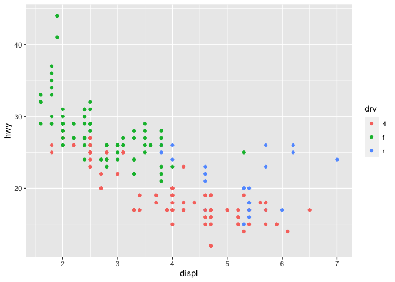
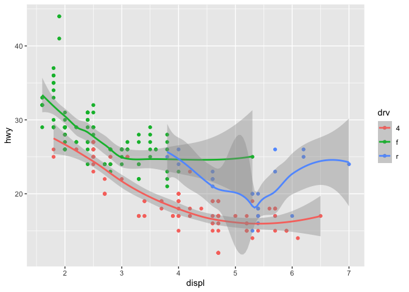
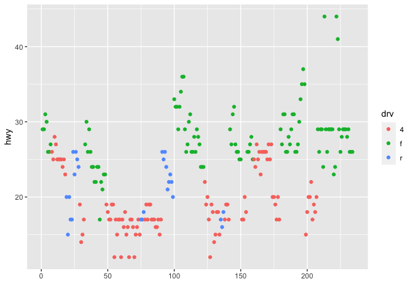
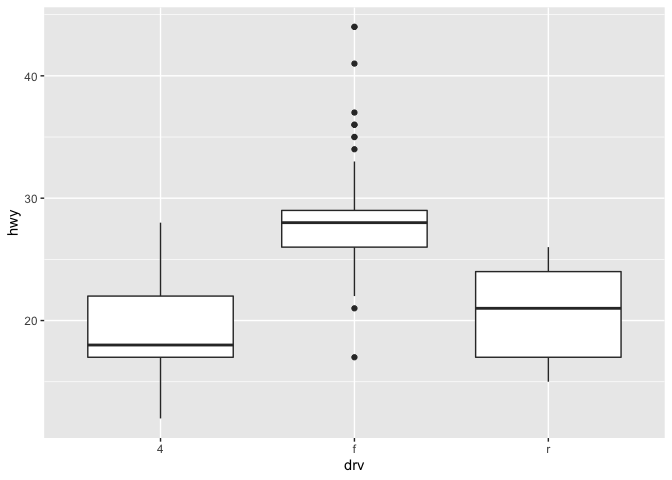
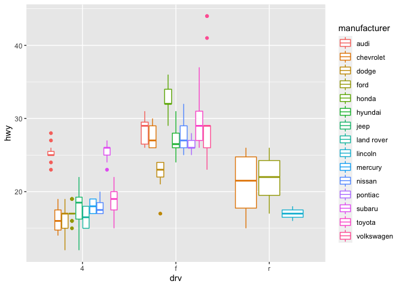
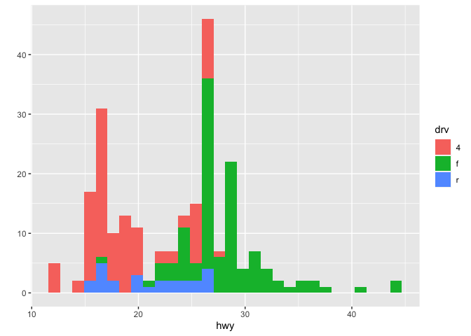
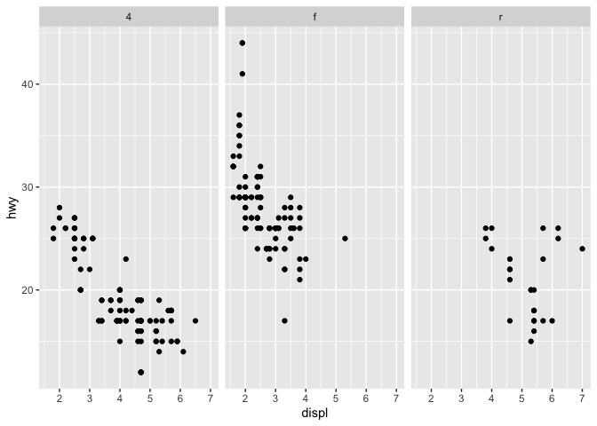
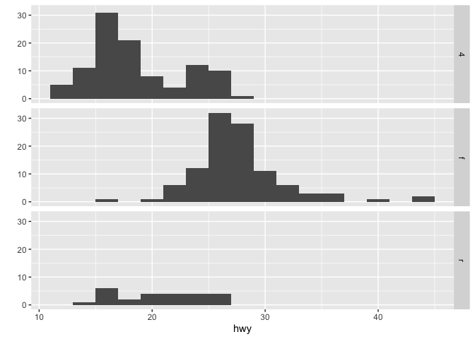

---
title: "qplot"
output: 
  html_document:
    keep_md: true
---

## qplot

First, load the ggplot2 package and the mpg dataset that is associated with it.


```r
library(ggplot2)
data("mpg")
```

We'll start by showing how easy and versatile qplot is. First, let's look at some data which comes with the ggplot2 package. The mpg data frame contains fuel economy data for 38 models of cars manufactured in 1999 and 2008. Run the R command str with the argument mpg. This will give you an idea of what mpg contains.


```r
str(mpg)
```

```
## Classes 'tbl_df', 'tbl' and 'data.frame':	234 obs. of  11 variables:
##  $ manufacturer: chr  "audi" "audi" "audi" "audi" ...
##  $ model       : chr  "a4" "a4" "a4" "a4" ...
##  $ displ       : num  1.8 1.8 2 2 2.8 2.8 3.1 1.8 1.8 2 ...
##  $ year        : int  1999 1999 2008 2008 1999 1999 2008 1999 1999 2008 ...
##  $ cyl         : int  4 4 4 4 6 6 6 4 4 4 ...
##  $ trans       : chr  "auto(l5)" "manual(m5)" "manual(m6)" "auto(av)" ...
##  $ drv         : chr  "f" "f" "f" "f" ...
##  $ cty         : int  18 21 20 21 16 18 18 18 16 20 ...
##  $ hwy         : int  29 29 31 30 26 26 27 26 25 28 ...
##  $ fl          : chr  "p" "p" "p" "p" ...
##  $ class       : chr  "compact" "compact" "compact" "compact" ...
```

We see that there are 234 points in the dataset concerning 11 different characteristics of the cars. Suppose we want to see if there's a correlation between engine displacement (displ) and highway miles per gallon (hwy). As we did with the plot function of the base system we could simply call qplot with 3 arguments, the first two are the variables we want to examine and the third argument data is set equal to the name of the dataset which contains them (in this case, mpg). Try this now.


```r
qplot(displ, hwy, data = mpg)
```

<!-- -->

A nice scatterplot done simply, right? All the labels are provided. The first argument is shown along the x-axis and the second along the y-axis. The negative trend (increasing displacement and lower gas mileage) is pretty clear. Now suppose we want to do the same plot but this time use different colors to distinguish between the 3 factors (subsets) of different types of drive (drv) in the data (front-wheel, rear-wheel, and 4-wheel). Again, qplot makes this very easy. We'll just add what ggplot2 calls an aesthetic, a fourth argument, color, and set it equal to drv. Try this now. (Use the up arrow key to save some typing.)


```r
qplot(displ, hwy, data = mpg, color=drv)
```

<!-- -->

See the legend to the right which qplot helpfully supplied? The colors were automatically assigned by qplot so the legend decodes the colors for you. Notice that qplot automatically used dots or points to indicate the data. These points are geoms (geometric objects). We could have used a different aesthetic, for instance shape instead of color, to distinguish between the drive types.

Now let's add a second geom to the default points. How about some smoothing function to produce trend lines, one for each color? Just add a fifth argument, geom, and using the R function c(), set it equal to the concatenation of the two strings "point" and "smooth". The first refers to the data points and second to the trend lines we want plotted. Try this now.

Now let's add a second geom to the default points. How about some smoothing function to produce trend lines, one for each color? Just add a fifth argument, geom, and using the R function c(), set it equal to the concatenation of the two strings "point" and "smooth". The first refers to the data points and second to the trend lines we want plotted. Try this now.


```r
qplot(displ, hwy, data = mpg, color=drv, geom=c("point", "smooth"))
```

```
## `geom_smooth()` using method = 'loess' and formula 'y ~ x'
```

<!-- -->

Notice the gray areas surrounding each trend lines. These indicate the 95% confidence intervals for the lines.

Before we leave qplot's scatterplotting ability, call qplot again, this time with 3 arguments. The first is y set equal to hwy, the second is data set equal to mpg, and the third is color set equal to drv. Try this now.


```r
qplot(y=hwy, data = mpg, color=drv)
```

<!-- -->

What's this plot showing? We see the x-axis ranges from 0 to 250 and we remember that we had 234 data points in our set, so we can infer that each point in the plot represents one of the hwy values (indicated by the y-axis). We've created the vector myhigh for you which contains the hwy data from the mpg dataset. Look at myhigh now.

 myhigh
  [1] 29 29 31 30 26 26 27 26 25 28 27 25 25 25 25 24 25 23 20 15 20 17 17 26 23 26 25 24 19 14 15 17 27 30 26 29 26 24 24 22 22 24 24 17 22
 [46] 21 23 23 19 18 17 17 19 19 12 17 15 17 17 12 17 16 18 15 16 12 17 17 16 12 15 16 17 15 17 17 18 17 19 17 19 19 17 17 17 16 16 17 15 17
 [91] 26 25 26 24 21 22 23 22 20 33 32 32 29 32 34 36 36 29 26 27 30 31 26 26 28 26 29 28 27 24 24 24 22 19 20 17 12 19 18 14 15 18 18 15 17
[136] 16 18 17 19 19 17 29 27 31 32 27 26 26 25 25 17 17 20 18 26 26 27 28 25 25 24 27 25 26 23 26 26 26 26 25 27 25 27 20 20 19 17 20 17 29
[181] 27 31 31 26 26 28 27 29 31 31 26 26 27 30 33 35 37 35 15 18 20 20 22 17 19 18 20 29 26 29 29 24 44 29 26 29 29 29 29 23 24 44 41 29 26
[226] 28 29 29 29 28 29 26 26 26

Comparing the values of myhigh with the plot, we see the first entries in the vector (29, 29, 31, 30,...) correspond to the leftmost points in the the plot (in order), and the last entries in myhigh (28, 29, 26, 26, 26) correspond to the rightmost plotted points. So, specifying the y parameter only, without an x argument, plots the values of the y argument in the order in which they occur in the data.

The all-purpose qplot can also create box and whisker plots.  Call qplot now with 4 arguments. First specify the variable by which you'll split the data, in this case drv, then specify the variable which you want to examine, in this case hwy. The third argument is data (set equal to mpg), and the fourth, the geom, set equal to the string "boxplot"


```r
qplot(drv, hwy, data=mpg, geom = "boxplot")
```

<!-- -->

We see 3 boxes, one for each drive. Now to impress you, call qplot with 5 arguments. The first 4 are just as you used previously, (drv, hwy, data set equal to mpg, and geom set equal to the string "boxplot"). Now add a fifth argument, color, equal to manufacturer.


```r
qplot(drv, hwy, data=mpg, geom = "boxplot", color=manufacturer)
```

<!-- -->

It's a little squished but we just wanted to illustrate qplot's capabilities. Notice that there are still 3 regions of the plot (determined by the factor drv). Each is subdivided into several boxes depicting different manufacturers.

Now, on to histograms. These display frequency counts for a single variable. Let's start with an easy one. Call qplot with 3 arguments. First specify the variable for which you want the frequency count, in this case hwy, then specify the data (set equal to mpg), and finally, the aesthetic, fill, set equal to drv. Instead of a plain old histogram, this will again use colors to distinguish the 3 different drive factors.


```r
qplot(hwy, data = mpg, fill=drv)
```

```
## `stat_bin()` using `bins = 30`. Pick better value with `binwidth`.
```

<!-- -->

See how qplot consistently uses the colors. Red (if 4-wheel drv is in the bin) is at the bottom of the bin, then green on top of it (if present), followed by blue (rear wheel drv). The color lets us see right away that 4-wheel drive vehicles in this dataset don't have gas mileages exceeding 30 miles per gallon.

It's cool that qplot can do this so easily, but some people may find this multi-color histogram hard to interpret. Instead of using colors to distinguish between the drive factors let's use facets or panels. (That's what lattice called them.) This just means we'll split the data into 3 subsets (according to drive) and make 3 smaller individual plots of each subset in one plot (and with one call to qplot).

Remember that with base plot we had to do each subplot individually. The lattice system made plotting conditioning plots easier. Let's see how easy it is with qplot.

We'll do two plots, a scatterplot and then a histogram, each with 3 facets. For the scatterplot, call qplot with 4 arguments. The first two are displ and hwy and the third is the argument data set equal to mpg. The fourth is the argument facets which will be set equal to the expression . ~ drv which is ggplot2's shorthand for number of rows (to the left of the ~) and number of columns (to the right of the ~). Here the . indicates a single row and drv implies 3, since there are 3 distinct drive factors. Try this now.


```r
qplot(displ, hwy, data=mpg, facets= .~drv)
```

<!-- -->

The result is a 1 by 3 array of plots. Note how each is labeled at the top with the factor label (4,f, or r). This shows us more detailed information than the histogram. We see the relationship between displacement and highway mileage for each of the 3 drive factors.

Now we'll do a histogram, again calling qplot with 4 arguments. This time, since we need only one variable for a histogram, the first is hwy and the second is the argument data set equal to mpg. The third is the argument facets which we'll set equal to the expression drv ~ . . This will give us a different arrangement of the facets. The fourth argument is binwidth. Set this equal to 2. Try this now.


```r
qplot(hwy, data=mpg, facets = drv~., binwidth=2)
```

<!-- -->
